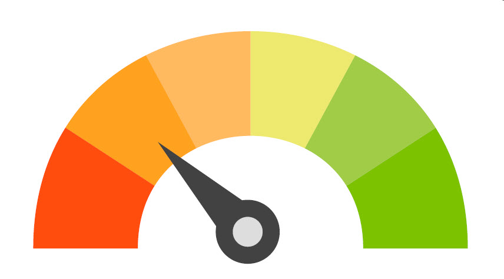
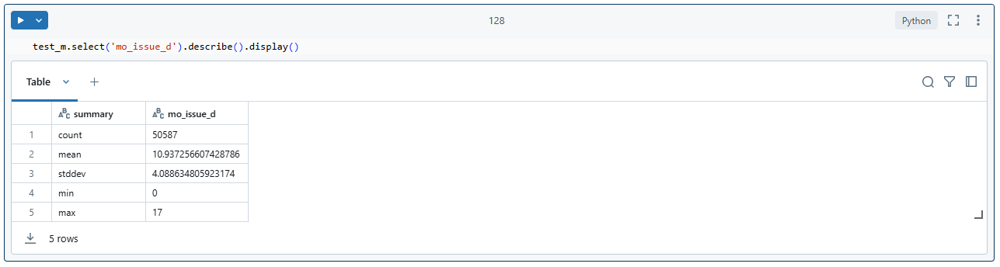

<!-- Improved compatibility of back to top link: See: https://github.com/othneildrew/Best-README-Template/pull/73 -->
<a id="readme-top"></a>
<!--
*** Thanks for checking out the Best-README-Template. If you have a suggestion
*** that would make this better, please fork the repo and create a pull request
*** or simply open an issue with the tag "enhancement".
*** Don't forget to give the project a star!
*** Thanks again! Now go create something AMAZING! :D
-->


<!-- PROJECT SHIELDS -->
<!--
*** I'm using markdown "reference style" links for readability.
*** Reference links are enclosed in brackets [ ] instead of parentheses ( ).
*** See the bottom of this document for the declaration of the reference variables
*** for contributors-url, forks-url, etc. This is an optional, concise syntax you may use.
*** https://www.markdownguide.org/basic-syntax/#reference-style-links
-->
[![Contributors][contributors-shield]][contributors-url]
[![Forks][forks-shield]][forks-url]
[![Stargazers][stars-shield]][stars-url]
[![Issues][issues-shield]][issues-url]
[![MIT License][license-shield]][license-url]
[![LinkedIn][linkedin-shield]][linkedin-url]


<!-- PROJECT LOGO -->
<br />
<div align="center">
  <a href="https://github.com/OtnielGomes/0_Portfolio-Credit_Risk_Analysis_with_Pytorch">
    
  </a>

<h3 align="center"> Credit Risk Analysis - Lending Club </h3>

  <p align="center">
    Classification of requested loans using Pytorch as the main classification model
    <br />
    <a href="https://github.com/OtnielGomes/0_Portfolio-Credit_Risk_Analysis_with_Pytorch"><strong>Explore the docs »</strong></a>
    <br />
    <br />
    <a href="https://github.com/OtnielGomes/0_Portfolio-Credit_Risk_Analysis_with_Pytorch">View Demo</a>
    ·
    <a href="https://github.com/OtnielGomes/0_Portfolio-Credit_Risk_Analysis_with_Pytorch/issues/new?labels=bug&template=bug-report---.md">Report Bug</a>
    ·
    <a href="https://github.com/OtnielGomes/0_Portfolio-Credit_Risk_Analysis_with_Pytorch/issues/new?labels=enhancement&template=feature-request---.md">Request Feature</a>
  </p>
</div>


<!-- TABLE OF CONTENTS -->
<details>
  <summary>Table of Contents</summary>
  <ol>
    <li>
      <a href="#about-the-project">About The Project</a>
      <ul>
        <li><a href="#built-with">Built With</a></li>
      </ul>
    </li>
    <li>
      <a href="#getting-started">Getting Started</a>
      <ul>
        <li><a href="#prerequisites">Prerequisites</a></li>
        <li><a href="#installation-of-librarys">Installation of librarys</a></li>
      </ul>
    </li>
    <li><a href="#the-project">The Project</a></li>
    <li><a href="#roadmap">Roadmap</a></li>
    <li><a href="#contributing">Contributing</a></li>
    <li><a href="#license">License</a></li>
    <li><a href="#contact">Contact</a></li>
    <li><a href="#acknowledgments">Acknowledgments</a></li>
  </ol>
</details>


<!-- ABOUT THE PROJECT -->
## About The Project

<br />
<div align="center">
  <a href="https://github.com/OtnielGomes/0_Portfolio-Credit_Risk_Analysis_with_Pytorch">
    
  </a>
</div>

# Description:

* This project will be built and implemented using the **Azure Databricks** environment, where classifiers will be built with neural network/machine learning models that will seek to predict whether a loan will be paid or not. The basis of the project will be a PyTorch model that will classify the requested loans. In the final model, a classifier will be created that will use the selected model together with some variables and information from the loan applicant to make the final classification, where the loans will be classified into 4 stages of default risk. According to the defined parameters, the classifier will decide whether the loan should be approved or rejected immediately, or if there is the possibility of a reassessment by the institution's stakeholders.

* In this project, I will work with a dataset taken from Kaggle, where I will perform a credit risk analysis. The data provided comes from LendingClub, a financial services company based in San Francisco, California. LendingClub was the first peer-to-peer lending platform to register its offerings as securities with the Securities and Exchange Commission (SEC) and to offer loan trading on a secondary market. The company offers personal loans of up to $40,000, with terms ranging from 24 to 60 months, and operates entirely online, with no physical branches.

* In this project, I will apply the CRISP-DM method, which follows the following steps:

  * 1-**Business understanding**:
  
    What does the business need?
  
  * 2-**Data understanding**:
  
    What data do we have/need? Is it clean?
  
  * 3-**Data preparation**:
  
    How do we organize the data for modeling?
  
  * 4-**Modeling**:
  
    What modeling techniques should we apply?
  
  * 5-**Evaluation**:
  
    What best meets the business objectives?
  
  * 6-**Implementation**:
  
    How do stakeholders access the results?

<p align="right">(<a href="#readme-top">back to top</a>)</p>


### Built With
* [![Databricks][Azure Databricks]][Azure Databricks-url]
* [![Language Python][Python]][Python-url]
* [![Apache][Apache Spark]][Apache Spark-url]
* [![PD][Pandas]][Pandas-url]
* [![NP][NumPy]][NumPy-url]
* [![Matplot][Matplotlib]][Matplotlib-url]
* [![Ploty Lib][Plotly]][Plotly-url]
* [![Torch][PyTorch]][PyTorch-url]
* [![Sklearn][scikit-learn]][scikit-learn-url]
* [![Ray][Ray Tune]][Ray Tune-url]

<p align="right">(<a href="#readme-top">back to top</a>)</p>


<!-- GETTING STARTED -->
## Getting Started

### Prerequisites

* Data Bricks - This project was developed in the Databricks environment, so the entire project structure is compatible with AzureDatabricks and Databricks Community. Below I will leave the link to create an account in the Databricks Community where it is free and at no cost and you will be able to run a copy of this project perfectly.
Link for create acount :

* [![Databricks CM][Azure Databricks CM]][Azure Databricks CM-url]

* ##### Now that your account is created, you will need to create a cluster in DataBricks. Below is the step-by-step guide to creating the cluster.

* ###### Step-by-Step Guide to Creating a Cluster in Databricks

   1-**Access Databricks**:
    - Log in to your Databricks account.

   2-**Navigate to the Clusters Section**:
    - In the side menu, click on **Compute** (or **Clusters**).

   3-**Create a New Cluster**:
    - Click on the **Create Cluster** button.

   4-**Configure the Cluster**:
    - **Cluster Name**: Give your cluster a name.
    - **Cluster Mode**: Choose the cluster mode (Standard, High Concurrency, etc.).
    - **Databricks Runtime Version**: Select the version of Databricks Runtime you want to use.
    - **Node Type**: Choose the node type (virtual machine) for the workers and the driver. - **Autoscaling**: Enable or disable autoscaling. If enabled, set the minimum and       maximum number of nodes.
    - **Worker Nodes**: Set the number of worker nodes.
    - **Driver Node**: Configure the driver node if necessary.
    - **Version used in this project**: 15.4 LTS (includes Apache Spark 3.5.0, Scala 2.12)

   5-**Advanced Settings (Optional)**:
    - **Libraries**: Add libraries that the cluster should load when starting.
    - **Spark Configurations**: Add Spark-specific configurations.
    - **Environment Variables**: Set environment variables if necessary.

   6-**Create the Cluster**:
    - After configuring all options, click **Create Cluster**.

  * #### Additional Resources

    * **Official Documentation**: See the official Databricks documentation for more details and advanced options: [Click here](https://learn.microsoft.com/en-us/azure/databricks/scenarios/quickstart-create-databricks-workspace-vnet-injection).


### Installation of librarys

* Install Libraries to the Cluster:

    * After creating the cluster, click on the cluster name to open its settings.

    *  Go to the Libraries tab.

    * Click Install New.

    * Choose the library source (e.g., PyPI, Maven, CRAN, DBFS, etc.).

    * Follow the instructions to install the desired library. For example, to install a library from PyPI, enter the package name and click Install.

* Librares:
  
  1-threadpoolctl: **PyPI**
     ```sh
     threadpoolctl==3.5.0
     ```
  2-spark-excel_2.12:0.14.0: **Marven**
     ```sh
     com.crealytics:spark-excel_2.12:0.14.0
     ```
  3-scikit-learn: **PyPI**
     ```sh
     scikit-learn==1.5.2
     ```
  4-category_encoders: **PyPI**
     ```sh
     category_encoders==2.6.3
     ```
  5-torch: **PyPI**
     ```sh
     torch==2.5.1
     ```
  6-torchmetrics: **PyPI**
     ```sh
     torchmetrics==1.4.2
     ```
  7-xgboost: **PyPI**
     ```sh
     xgboost==2.1.0
     ```
  8-ray[tune]: **PyPI**
     ```sh
     ray[tune]==2.38.0
     ```

<p align="right">(<a href="#readme-top">back to top</a>)</p>


<!-- USAGE EXAMPLES -->
## The Project

# 1-Business Understanding

## Lending Club

LendingClub is a company that specializes in providing online loans, which further reinforces the need for an accurate assessment during the analysis of the approval of requested loans.

During a loan application, the company makes only two decisions: grant the loan to the applicant or block the release of the loan. This decision is based on the data present in the registry and the information provided by the potential borrower.

We will only use the records with the following final payment statuses:

* Fully Paid
* Downloaded

The other payment statuses have not yet had final payment completion because they have not yet been completed, so there is no possibility of classifying them.

#### What is the objective of this project?

* A machine learning model will be created that seeks to make predictions that during the loan application will indicate whether the borrower will be a good payer or not.

* The main objective is to create analyses that use only the information collected at the time of the loan application. The model focuses on preventing the release of loans to potentially defaulting borrowers, using only the variables available at the time of the request.

* I will seek to generate several insights so that we have information about the institution's objective, which is to reduce unpaid loans and potential losses in relation to recent years.

#### To deal with default, we have some possible solutions:

* Do not release loans classified as risky loans that will potentially not be paid.

* If released, charge a higher interest rate for these cases.

#### For loans classified as low-risk loans that will potentially be fully paid, we can consider:

* In addition to releasing the loans, increase the loan amount in these cases.

* Reduce the interest rate, aiming to improve the relationship with the target customer and increase the company's profitability with higher-value loans.

* Offer more services to this borrower.

# 2-Data Understanding

## The dataset

**We have records from 12-2006 to 12-2015 with information about the payment history of this institution's customers**

**Data file**: - loan.csv

**Data dictionary**: - LoanStats tab in LCDataDictionary.xlsx

**Target dependent variable**: - 'loan_status'

**Source** : https://www.kaggle.com/datasets/ranadeep/credit-risk-dataset/data?select=loan

## Adjusting the dataset for the project

* Before starting the analyzes and training the models, the data set will be adjusted to the proposal that will be the objective of this project. The objective is to create one or more models capable of predicting whether the borrower will pay all the loan installments or become a defaulter, failing to pay the loan.

* From now on, the dataset will only be separated with records that correspond to loans that have already been closed. The loan_status variable allows you to define the payment statuses that characterize these loans. 

* They are: 

* **Fully Paid**

* **Charged Off**

##### Note:

The payment statuses below will not be used because they do not comply with the institution's credit policy. Since this is a credit risk analysis model, it is important to build it now so that it adapts to the loan requests that will be made by the institution in the future.

* Does not meet the credit policy. Status:Fully Paid

* Does not meet the credit policy. Status:Charged Off

<br />
<div align="left">
  <a href="https://github.com/OtnielGomes/0_Portfolio-Credit_Risk_Analysis_with_Pytorch">
    
  </a>
</div>
<br />


## Classifying variables:

#### Concepts for Classification of variables according to statistics:

**Quantitative or numerical variables**:

* *Discrete*: only take integer values

* *Continuous*: assumes any value in the range of real numbers

**Qualitative or categorical variables**:

* *Nominals*: when categories do not have a natural order

* *Ordinals*: when categories can be ordered.

```
  # Categorical Variables
  
  categorical_nominals =  [
     'verification_status', 'emp_title', 'home_ownership', 'purpose', 'title', 'addr_state', 'initial_list_status', 'loan_status', 
  
  ]
  
  categorical_ordinals = [ 
     'grade', 'sub_grade', 'term', 'emp_length', 
  ]
  
  # Numerical Variables
  
  numerical_discrete = [
      'delinq_2yrs', 'earliest_cr_line', 'inq_last_6mths', 'open_acc', 'pub_rec', 'total_acc', 'acc_now_delinq', 'collections_12_mths_ex_med', 'issue_d'
  ]
  
  
  numerical_continuous = [
     'loan_amnt', 'funded_amnt', 'int_rate', 'installment', 'annual_inc', 'dti', 'revol_bal', 'revol_util', 'tot_coll_amt', 'tot_cur_bal', 'total_rev_hi_lim',
  
  ]
```
<br />
<div align="left">
  <a href="https://github.com/OtnielGomes/0_Portfolio-Credit_Risk_Analysis_with_Pytorch">
    
  </a>
</div>
<br />

# 3 - Data Preparation

* In this initial step, I will clean the data. We have a lot of invalid data. Initially, I will start by checking the data typing: continuous numeric data will be of type double, and discrete numeric data will be of type integer. This approach will already do a great deal of removing invalid values ​​from the numeric columns. In addition, categorical variables will be checked according to their respective valid categories. 

* Initially, all invalid values ​​will be marked as null, so that at the end of the analysis, I can decide whether to remove them or fill them with some data imputation technique.
### Note:

* The initial data cleaning was performed with the function above.

* **Discrete numeric variables**:

  * These variables were converted to the **'Integer'** type, and the data was filtered in which the values ​​present in the column that were not of the 'Integer' type were removed and filled as null. For example, if a value in a column was 2.3, this value would be considered null, taking into account that discrete variables cannot be partitioned into real numbers.

* **Continuous numeric variables**:

  * They were also converted to their corresponding type. Therefore, the data was filtered in which the values ​​present in the column that were not of the **'Double'** type were removed and filled as null. This approach has already managed to solve the problem of string values ​​that were present in the numeric columns.

* **Categorical/dummy variables**:

  * The data was filtered using the dictionary with valid categories for each variable, and if there were values ​​that were outside these parameters, they were removed and filled in as null.

## EDA 

#### Next steps:

#### Feature selection:

* In this step, I will select features using two approaches:

  * **First**, I will consider the **context** of each of the variables and their importance in the records of this dataset.

  * **Second**, I will evaluate the correlation and relationship of the features with the target variable, which is **loan_status**.

* Based on these points and concepts, I will choose the features that add value to the solution of this problem.

* To calculate the correlation between the columns, I will define a function to index the categorical columns. I will use the correlation to check for numerical variables, while for categorical variables I will use the p-value along with the chi-square (chi2) test.

#### Splitting the training and testing data

* From here on, all the analyses will be based on our training dataset, which will be approximately 80% of the total dataset. I will choose to separate from this point on to avoid leaking **test data**, since this data cannot be influenced by the analysis or data modeling that will be applied to the training data.

* Since this is a credit risk analysis, it is important to consider that the division of the data must take into account the chronological order of the records. This is important to verify the performance of the model with past data (loans that were used for training) in relation to future data (loans that will be requested in the future).

* In other words, this step is important to verify how well the model trained with past data can predict the default of credit applicants at a future point in time.

* Then I will use the **mo_issue_d** variable to classify the records in chronological order, and the division of our data is as follows:

  * **trainset**: Approximately 80% of the records being the oldest and in chronological order.

  * **testset**: Approximately 20% of the records being the newest and in chronological order.

* I will make a small adjustment so that the data is distributed more organically, I will be looking for a margin where we have a time point between the training data and another for the test data. Therefore, with this adjustment we will not have loans with the same number of months in the training and testing data.

### Separating training and test data

```
  # Sorting the data
sorted_dataset = df
sorted_dataset = sorted_dataset.orderBy('mo_issue_d', ascending = False)

# Creating an id for each record in an orderly manner
sorted_dataset = sorted_dataset.withColumn('index', F.monotonically_increasing_id()) 

sorted_dataset.select('index', 'loan_amnt', 'loan_status', 'mo_issue_d') \
    .limit(10) \
    .display()
```
<br />
<div align="left">
  <a href="https://github.com/OtnielGomes/0_Portfolio-Credit_Risk_Analysis_with_Pytorch">
    
  </a>
</div>
<br />

#### Looking for a margin for data division

```
# Calculating the limit for division
  
  total_data = sorted_dataset.count()
  
  train_size = int(total_data * 0.8)
  
  # Partitioning the data
  # trainset
  train_m = sorted_dataset.filter(F.col('index') < train_size)
  
  # testset
  test_m = sorted_dataset.filter(F.col('index') >= train_size)
```
#### Train margin

```
  train_m.select('mo_issue_d').describe().display()
```
<br />
<div align="left">
  <a href="https://github.com/OtnielGomes/0_Portfolio-Credit_Risk_Analysis_with_Pytorch">
    
  </a>
</div>
<br />

#### Test margin

```
  test_m.select('mo_issue_d').describe().display()
```
<br />
<div align="left">
  <a href="https://github.com/OtnielGomes/0_Portfolio-Credit_Risk_Analysis_with_Pytorch">
    
  </a>
</div>
<br />

#### Final parameters for splitting training and test data:

* I will be considering the number of months as 17 with a parameter to separate the training and test data.

##### For the training data, it will be as follows:

* **training_set**: from **18** months to **102** months of loan time in relation to the maximum data collection period.

* There will be records of loans from **1 year and 6 months to loans of 8 years and 6 months**.

##### For the test data, it will be as follows:

* **test_set**: from **0** months to **17** months of loan time in relation to the maximum data collection period

* There will be records of loans from **0 months to loans of 1 year and 5 months**.

### Checking payments status train data and test data:

<br />
<div align="left">
  <a href="https://github.com/OtnielGomes/0_Portfolio-Credit_Risk_Analysis_with_Pytorch">
    
  </a>
</div>
<br />

<br />
<div align="left">
  <a href="https://github.com/OtnielGomes/0_Portfolio-Credit_Risk_Analysis_with_Pytorch">
    
  </a>
</div>
<br />

## Analyzing problems and possible solutions

### With this data, what are the impacts generated by the institution through the loans granted?

<br />
<div align="left">
  <a href="https://github.com/OtnielGomes/0_Portfolio-Credit_Risk_Analysis_with_Pytorch">
    
  </a>
</div>
<br />

### Insight:

It can be seen that, in total, loans worth **US$ 3,419,985,650.00** were granted. Of these, **US$ 2,763,446,275.00** was paid in full, while **US$ 656,539,375.00** was lost in part or in full.

### So, what is the consequence of a wrong classification when granting a loan?

If we consider that the loans that were considered lost by Lending Club, if they were declined at the time of application, a **loss** of approximately **US$ 656,539,375.00** could have been avoided.

### What if there was the opposite situation?

If loans that were considered **paid** by Lending Club at the time of application were **unfairly denied**? Because they presented a risk of fraud to the institution. What would be the consequences of this scenario?

<br />
<div align="left">
  <a href="https://github.com/OtnielGomes/0_Portfolio-Credit_Risk_Analysis_with_Pytorch">
    
  </a>
</div>
<br />

### Insight:

It is possible to note that loans that were **fully paid** generate a gross interest amount of **US$ 380,373,134.10**. If these loans were denied, this would be a parameter to quantify the **financial loss** that would be caused to the institution.

## Cheking numerical discrete variables

### Note:

* To analyze the discrete variables, I chose to separate them, as some variables, due to the nature of their distribution, are more suitable for visualization through histoplots, while others are more appropriate for countplots.

<br />
<div align="left">
  <a href="https://github.com/OtnielGomes/0_Portfolio-Credit_Risk_Analysis_with_Pytorch">
    
  </a>
</div>
<br />

<br />
<div align="left">
  <a href="https://github.com/OtnielGomes/0_Portfolio-Credit_Risk_Analysis_with_Pytorch">
    
  </a>
</div>
<br />

<p align="right">(<a href="#readme-top">back to top</a>)</p>


<!-- ROADMAP -->
## Roadmap

- [ ] Feature 1
- [ ] Feature 2
- [ ] Feature 3
    - [ ] Nested Feature

See the [open issues](https://github.com/OtnielGomes/0_Portfolio-Credit_Risk_Analysis_with_Pytorch/issues) for a full list of proposed features (and known issues).

<p align="right">(<a href="#readme-top">back to top</a>)</p>


<!-- CONTRIBUTING -->
## Contributing

Contributions are what make the open source community such an amazing place to learn, inspire, and create. Any contributions you make are **greatly appreciated**.

If you have a suggestion that would make this better, please fork the repo and create a pull request. You can also simply open an issue with the tag "enhancement".
Don't forget to give the project a star! Thanks again!

1. Fork the Project
2. Create your Feature Branch (`git checkout -b feature/AmazingFeature`)
3. Commit your Changes (`git commit -m 'Add some AmazingFeature'`)
4. Push to the Branch (`git push origin feature/AmazingFeature`)
5. Open a Pull Request

<p align="right">(<a href="#readme-top">back to top</a>)</p>

### Top contributors:

<a href="https://github.com/github_username/repo_name/graphs/contributors">
  
</a>


<!-- LICENSE -->
## License

Distributed under the MIT License. See `LICENSE.txt` for more information.

<p align="right">(<a href="#readme-top">back to top</a>)</p>


<!-- CONTACT -->
## Contact

Your Name - [@twitter_handle](https://twitter.com/twitter_handle) - email@email_client.com

Project Link: [https://github.com/github_username/repo_name](https://github.com/github_username/repo_name)

<p align="right">(<a href="#readme-top">back to top</a>)</p>


<!-- ACKNOWLEDGMENTS -->
## Acknowledgments

* []()
* []()
* []()

<p align="right">(<a href="#readme-top">back to top</a>)</p>


<!-- MARKDOWN LINKS & IMAGES -->
<!-- https://www.markdownguide.org/basic-syntax/#reference-style-links -->
[contributors-shield]: https://img.shields.io/github/contributors/OtnielGomes/0_Portfolio-Credit_Risk_Analysis_with_Pytorch.svg?style=for-the-badge
[contributors-url]: https://github.com/OtnielGomes/0_Portfolio-Credit_Risk_Analysis_with_Pytorch/graphs/contributors
[forks-shield]: https://img.shields.io/github/forks/OtnielGomes/0_Portfolio-Credit_Risk_Analysis_with_Pytorch.svg?style=for-the-badge
[forks-url]: https://github.com/OtnielGomes/0_Portfolio-Credit_Risk_Analysis_with_Pytorch/network/members
[stars-shield]: https://img.shields.io/github/stars/OtnielGomes/0_Portfolio-Credit_Risk_Analysis_with_Pytorch.svg?style=for-the-badge
[stars-url]: https://github.com/OtnielGomes/0_Portfolio-Credit_Risk_Analysis_with_Pytorch/stargazers
[issues-shield]: https://img.shields.io/github/issues/OtnielGomes/0_Portfolio-Credit_Risk_Analysis_with_Pytorch.svg?style=for-the-badge
[issues-url]: https://github.com/OtnielGomes/0_Portfolio-Credit_Risk_Analysis_with_Pytorch/issues
[license-shield]: https://img.shields.io/github/license/OtnielGomes/0_Portfolio-Credit_Risk_Analysis_with_Pytorch.svg?style=for-the-badge
[license-url]: https://github.com/OtnielGomes/0_Portfolio-Credit_Risk_Analysis_with_Pytorch/blob/master/LICENSE.txt
[linkedin-shield]: https://img.shields.io/badge/-LinkedIn-black.svg?style=for-the-badge&logo=linkedin&colorB=555
[linkedin-url]: https://linkedin.com/in/otnielgomes
[product-screenshot]: images/screenshot.png
[Next.js]: https://img.shields.io/badge/next.js-000000?style=for-the-badge&logo=nextdotjs&logoColor=white
[Next-url]: https://nextjs.org/
[React.js]: https://img.shields.io/badge/React-20232A?style=for-the-badge&logo=react&logoColor=61DAFB
[React-url]: https://reactjs.org/
[Vue.js]: https://img.shields.io/badge/Vue.js-35495E?style=for-the-badge&logo=vuedotjs&logoColor=4FC08D
[Vue-url]: https://vuejs.org/
[Angular.io]: https://img.shields.io/badge/Angular-DD0031?style=for-the-badge&logo=angular&logoColor=white
[Angular-url]: https://angular.io/
[Svelte.dev]: https://img.shields.io/badge/Svelte-4A4A55?style=for-the-badge&logo=svelte&logoColor=FF3E00
[Svelte-url]: https://svelte.dev/
[Laravel.com]: https://img.shields.io/badge/Laravel-FF2D20?style=for-the-badge&logo=laravel&logoColor=white
[Laravel-url]: https://laravel.com
[Bootstrap.com]: https://img.shields.io/badge/Bootstrap-563D7C?style=for-the-badge&logo=bootstrap&logoColor=white
[Bootstrap-url]: https://getbootstrap.com
[JQuery.com]: https://img.shields.io/badge/jQuery-0769AD?style=for-the-badge&logo=jquery&logoColor=white
[JQuery-url]: https://jquery.com 

[Azure Databricks]: https://img.shields.io/badge/Databricks-FF3621?style=for-the-badge&logo=Databricks&logoColor=white
[Azure Databricks-url]:  https://azure.microsoft.com/en-us/pricing/purchase-options/azure-account?icid=databricks

[PyTorch]: https://img.shields.io/badge/PyTorch-%23EE4C2C.svg?style=for-the-badge&logo=PyTorch&logoColor=white
[PyTorch-url]: https://pytorch.org

[scikit-learn]: https://img.shields.io/badge/scikit--learn-%23F7931E.svg?style=for-the-badge&logo=scikit-learn&logoColor=white
[scikit-learn-url]: https://scikit-learn.org/stable/

[Apache Spark]: https://img.shields.io/badge/Apache%20Spark-FDEE21?style=flat-square&logo=apachespark&logoColor=black
[Apache Spark-url]: https://spark.apache.org/

[Pandas]: https://img.shields.io/badge/pandas-%23150458.svg?style=for-the-badge&logo=pandas&logoColor=white
[Pandas-url]: https://pandas.pydata.org/

[Ray Tune]: https://img.shields.io/badge/Ray-028CF0.svg?style=for-the-badge&logo=Ray&logoColor=white
[Ray Tune-url]: https://docs.ray.io/en/latest/tune/index.html

[Matplotlib]: https://img.shields.io/badge/Matplotlib-%23ffffff.svg?style=for-the-badge&logo=Matplotlib&logoColor=black
[Matplotlib-url]: https://matplotlib.org/

[Plotly]: https://img.shields.io/badge/Plotly-%233F4F75.svg?style=for-the-badge&logo=plotly&logoColor=white
[Plotly-url]: https://plotly.com/graphing-libraries/

[NumPy]: https://img.shields.io/badge/numpy-%23013243.svg?style=for-the-badge&logo=numpy&logoColor=white
[NumPy-url]: https://numpy.org/

[Python]: https://img.shields.io/badge/python-3670A0?style=for-the-badge&logo=python&logoColor=ffdd54
[Python-url]: https://www.python.org/

[Azure Databricks CM]: https://img.shields.io/badge/Databricks-FF3621?style=for-the-badge&logo=Databricks&logoColor=white
[Azure Databricks CM-url]: https://community.cloud.databricks.com/
